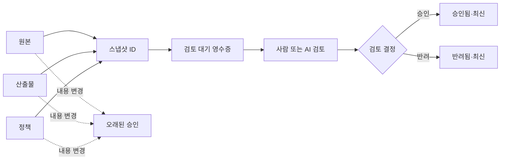

# evidence-lock

사람이나 AI가 내린 검토 결정을 원본·산출물·정책의 정확한 바이트에 묶고, 그중 하나라도 달라지면 기존 승인이 더는 유효하지 않다고 알려 주는 도구입니다.

[](https://github.com/eun7661010/evidence-lock/actions/workflows/ci.yml)
[](https://github.com/eun7661010/evidence-lock/releases)
[](https://www.python.org/)
[](#호환-환경)
[](LICENSE)

[English](README.md)

## 어떤 문제를 해결하나요?

보고서나 생성 문서, 모델 출력, 배포 후보를 검토해 승인했다고 가정해 보겠습니다. 그 뒤에 원본이나 결과물, 또는 합격 기준을 적은 정책이 바뀌어도 승인 기록에는 여전히 `approved`가 남을 수 있습니다. 이때 그 승인은 현재 파일을 검토한 결과가 아닙니다.

`evidence-lock`은 다음 한 가지 질문에 답합니다.

> 이 검토 결정이 지금 있는 원본·산출물·정책의 정확한 내용에도 그대로 적용되는가?

도구는 세 파일 묶음의 SHA-256을 휴대 가능한 JSON 영수증에 기록합니다. 이후 사람이나 AI의 명시적인 검토 결정을 영수증에 결합합니다. 기록한 파일이 하나라도 달라지면 상태를 즉시 `stale`로 바꿉니다. 모든 작업은 로컬에서 이루어지며, Git 저장소나 서버가 필요하지 않습니다. 실행 중 네트워크에 접속하지 않고 파이썬 표준 라이브러리 외의 런타임 의존성도 없습니다.

## 영수증 상태는 어떻게 달라지나요?



영수증에는 루트 아래의 상대 경로, 파일 수, 바이트 수, 내용 해시만 저장합니다. 개인 홈 디렉터리가 들어 있는 절대 경로는 남기지 않습니다. 검토자 표기와 검토 유형, 결정, 시각, 요약은 별도의 검토 ID에 함께 묶입니다. 따라서 누군가가 승인 결정을 반려로 바꾸거나 검토자 표기를 수정하면 영수증은 조용히 다른 뜻으로 바뀌지 않고 `invalid`가 됩니다.

## 실행 전후를 비교해 보세요

승인된 영수증은 사람이 직접 열어 볼 수 있는 JSON입니다.

```json
{
  "receipt_version": "evidence-lock/receipt/v1",
  "snapshot_id": "sha256:…",
  "evidence": {
    "sources": [{"path": "source/draft.txt", "kind": "file", "sha256": "…"}],
    "artifacts": [{"path": "artifact/report.txt", "kind": "file", "sha256": "…"}],
    "policies": [{"path": "policy/review-policy.json", "kind": "file", "sha256": "…"}]
  },
  "review": {
    "reviewer": "reviewer-01",
    "reviewer_type": "human",
    "decision": "approved",
    "review_id": "sha256:…"
  }
}
```

현재 파일이 검토 당시와 같으면 다음과 같이 확인됩니다.

```json
{"ok":true,"status":"approved","exit_code":0,"changes":[],"errors":[]}
```

`artifact/report.txt`를 고치고 같은 명령을 다시 실행하면 기존 승인이 오래되었다고 판단합니다.

```json
{"ok":false,"status":"stale","exit_code":5,"changes":["artifacts:artifact/report.txt: sha256 changed"],"errors":[]}
```

## 3분 빠른 시작

저장소의 예제에는 이 프로젝트를 위해 새로 쓴 합성 문서만 들어 있습니다.

```bash
python -m pip install .
cd examples/synthetic-project

evidence-lock create \
  --source source/draft.txt \
  --artifact artifact/report.txt \
  --policy policy/review-policy.json \
  --output demo-pending.json

evidence-lock review demo-pending.json \
  --reviewer reviewer-01 \
  --reviewer-type human \
  --decision approved \
  --summary "합성 보고서가 합성 검토 정책을 따릅니다." \
  --output demo-approved.json

evidence-lock verify demo-approved.json --format json
```

마지막 명령은 승인 영수증의 구조와 ID가 올바르고, 기록한 원본·산출물·정책이 모두 그대로일 때만 종료 코드 `0`을 반환합니다. 이미 있는 영수증은 덮어쓰지 않습니다.

AI 검토를 기록하려면 `--reviewer-type ai`를 사용하면 됩니다. 다만 이 값은 호출자가 검토자 유형을 어떻게 분류했는지 표시할 뿐입니다. `evidence-lock`은 모델을 호출하지 않으며, 모델 신원을 인증하거나 검토 품질을 판단하지도 않습니다.

## 명령어

| 명령어 | 하는 일 |
| --- | --- |
| `evidence-lock create` | 원본·산출물·정책을 해시해 검토 대기 영수증을 만듭니다. |
| `evidence-lock review` | 현재 파일이 그대로인지 확인한 뒤 새 검토 영수증을 만듭니다. |
| `evidence-lock verify` | 해시를 다시 계산해 `approved`, `pending`, `rejected`, `stale`, `invalid` 가운데 하나를 반환합니다. |
| `evidence-lock schema` | 내장된 Draft 2020-12 JSON 스키마를 출력하거나 파일로 저장합니다. |

원본·산출물·정책은 각각 하나 이상 지정해야 합니다. 같은 종류의 경로를 여러 개 기록하려면 `--source`, `--artifact`, `--policy`를 반복해서 씁니다. 파일뿐 아니라 디렉터리도 지정할 수 있습니다. 디렉터리는 내부의 모든 일반 파일을 상대 경로 순으로 정렬한 뒤, 각 파일의 경로·내용 해시·크기를 함께 해시합니다. 읽을 수 없는 하위 폴더가 하나라도 있으면 조용히 빼지 않고 스냅샷 생성을 중단합니다.

인수와 파이썬 API는 [CLI와 라이브러리 참고 문서](docs/cli-and-library.md)에 정리했습니다.

## 상태와 종료 코드

| 상태 | 뜻 | 종료 코드 |
| --- | --- | ---: |
| `approved` | 영수증과 검토 ID가 올바르고, 모든 파일이 같으며, 기록된 결정이 승인입니다. | `0` |
| `pending` | 모든 파일은 같지만 아직 검토 결정이 없습니다. | `3` |
| `rejected` | 모든 파일은 같고 기록된 결정이 반려입니다. | `4` |
| `stale` | 영수증 구조는 올바르지만 기록한 경로가 사라졌거나, 읽을 수 없거나, 내용이 달라졌습니다. | `5` |
| `invalid` | JSON 구조, 스키마 필드, 스냅샷 ID, 검토 ID가 서로 맞지 않습니다. | `6` |

입출력 오류는 `1`, 명령 인수 오류는 `2`를 반환합니다. CI에서는 검토가 필요한 상태, 반려된 상태, 파일이 바뀐 상태, 영수증 자체가 손상된 상태를 서로 다르게 처리할 수 있습니다.

## 어디에 쓸 수 있나요?

- 생성한 PDF나 데이터셋, 설정 파일, 원본 문서가 달라지면 사람의 기존 승인을 무효화할 수 있습니다.
- AI 검토 결과를 모델이 살펴본 입력, 출력 산출물, 평가 정책의 정확한 내용에 묶을 수 있습니다.
- 별도의 승인 서버 없이도 최신 승인 영수증이 있는지 CI에서 확인할 수 있습니다.
- 원래 절대 경로를 노출하지 않고 Windows, macOS, Linux 사이에서 검토 기록을 옮길 수 있습니다.
- 바뀔 수 있는 정책 이름만 적는 대신, 검토 당시에 실제로 사용한 정책 파일의 내용까지 보존할 수 있습니다.

영수증은 평범한 JSON 파일입니다. 배포 후보와 함께 커밋하거나, 문서 묶음에 보관하거나, 다음 CI 작업으로 넘길 수 있습니다. 다만 그 저장 위치를 신뢰할 수 있는지는 사용자가 따로 판단해야 합니다.

## 개인정보와 경로를 어떻게 다루나요?

- 증거 경로는 `--root` 아래의 상대 경로여야 합니다. 절대 경로와 `..` 상위 이동은 거부합니다.
- 역할이 다르더라도 같은 증거 경로를 중복해 쓰거나 상위·하위 경로를 함께 지정할 수 없습니다.
- 심볼릭 링크를 따라 루트 밖으로 나가지 않도록 모든 심볼릭 링크를 거부합니다.
- 영수증 JSON의 중복 객체 키, 잘못된 유니코드 서로게이트, 지원 범위를 벗어난 RFC 3339 시각 형식은 거부합니다.
- 영수증에는 상대 경로만 남습니다. 루트, 홈 디렉터리, 명령줄, 환경 변수, 파일 내용, 네트워크 위치는 저장하지 않습니다.
- 캡처한 디렉터리 안에는 영수증을 만들 수 없습니다. 생성 직후 스스로 `stale`이 되는 상황을 막기 위해서입니다.
- 이미 있는 출력 파일은 덮어쓰지 않습니다.
- 검토자 표기와 요약은 사용자가 입력한 그대로 JSON에 남습니다. 개인 식별 정보 대신 `reviewer-01` 같은 비개인 표기를 쓰고, 인증 정보나 기밀 문장을 넣지 마세요.

신뢰 경계를 넘어 영수증을 전달하려면 먼저 [보안·개인정보 모델](docs/security-model.md)을 읽어 주세요.

## 이 도구가 증명하지 않는 것

`evidence-lock`은 검토 대상과 결정이 여전히 맞물려 있는지 확인하는 도구입니다. 전자서명이나 신원 인증 시스템은 아닙니다.

다음 사항은 보장하지 않습니다.

- 표시된 사람이 실제로 검토했는지, 또는 표시된 모델이 실제로 실행되었는지 인증하지 않습니다.
- 승인된 산출물이 정확하거나 안전하거나 합법적이거나 품질이 높다고 증명하지 않습니다.
- 영수증과 증거 파일을 함께 바꿀 수 있는 공격자로부터 보호하지 않습니다.
- 키 관리, 전자서명, 투명성 로그, 신뢰할 수 있는 시각 증명, 빌드 출처, 증거 보관 연속성을 제공하지 않습니다.
- 테스트를 실행하거나, 명령을 기록하거나, 에이전트를 감시하거나, 증거를 업로드하거나, 파일 내용을 보관하지 않습니다.
- 빈 디렉터리, 수정 시각, 권한 비트, 파일 소유권은 추적하지 않습니다.

암호학적으로 신원을 확인하거나 서명된 공급망 증명이 필요하다면 그 목적에 맞는 도구를 사용해야 합니다.

## 비슷한 프로젝트와 무엇이 다른가요?

이 프로젝트는 다음 도구를 대체하지 않고 그 앞뒤의 작은 검토 작업을 보완합니다.

- [in-toto](https://in-toto.io/docs/getting-started/)는 소프트웨어 공급망 단계와 원재료·산출물을 서명해 기록하고 검증합니다.
- [Witness](https://github.com/in-toto/witness)는 서명된 증명, 정책 평가, 신원 연동, 출처 기록을 제공합니다.
- [Sigstore Cosign](https://docs.sigstore.dev/cosign/verifying/verify/)은 소프트웨어 산출물의 서명과 증명을 검증합니다.
- [SLSA provenance](https://slsa.dev/spec/v1.2/provenance)는 소프트웨어 산출물이 어디서 언제 어떻게 만들어졌는지 표현합니다.
- [DVC](https://dvc.org/doc/user-guide/project-structure/pipelines-files)는 데이터와 재현 가능한 파이프라인 상태를 버전으로 관리합니다.
- [BeforeDone](https://github.com/rrrrrredy/beforedone)은 설정한 명령의 실행 결과를 관련 Git 파일에 묶어, 파일이 바뀌면 코딩 에이전트의 완료 증거를 오래된 것으로 처리합니다.
- [Agent Receipts](https://github.com/inchwormz/agent-receipts)는 에이전트가 실행한 작업을 해시 체인 증거로 기록하고 주장의 근거를 평가합니다.
- [Treeship](https://github.com/zerkerlabs/treeship)은 에이전트 작업에 서명되고 연결된 영수증과 범위가 정해진 사람 승인을 제공합니다.

`evidence-lock`은 더 작은 범위를 선택합니다. Git 없이도 실행되며, 명령을 대신 실행하지 않고, 키나 서버를 두지 않습니다. 대신 원본·산출물·정책이라는 세 파일 묶음을 하나의 명시적인 검토 결정에 연결하는 데 집중합니다. 자세한 차이는 [생태계와 범위 문서](docs/ecosystem-and-scope.md)에 적었습니다.

## 호환 환경

CI에서는 현재 GitHub가 제공하는 Windows, macOS, Ubuntu 환경에서 Python 3.10과 3.13을 검사합니다. 패키지는 Python 3.10부터 3.13까지 지원하며 런타임 의존성이 없습니다.

디렉터리 스냅샷은 운영체제 사이에서 같은 결과를 내기 위해 수정 시각과 권한 비트를 무시합니다. Linux에서는 구분되지만 Windows나 흔한 macOS 파일시스템에서는 모호해질 수 있는 대소문자 충돌 파일명은 거부합니다.

## 문서

- [설계와 영수증 의미](docs/design.md)
- [CLI와 파이썬 라이브러리 참고](docs/cli-and-library.md)
- [보안과 개인정보 모델](docs/security-model.md)
- [생태계 비교와 프로젝트 범위](docs/ecosystem-and-scope.md)
- [문제 해결](docs/troubleshooting.md)
- [AI 에이전트용 기능 요약](llms.txt)

## 기여하기

이슈와 풀 리퀘스트를 환영합니다. 먼저 [CONTRIBUTING.md](CONTRIBUTING.md)를 읽고 합성 fixture만 사용해 주세요. 비공개 문서, 개인 절대 경로, 인증 정보, 실제 검토 기록은 첨부하지 마세요. 처음 기여하기 좋은 범위는 이슈의 `good first issue` 표지로 구분합니다.

[Apache License 2.0](LICENSE)에 따라 사용할 수 있습니다.
