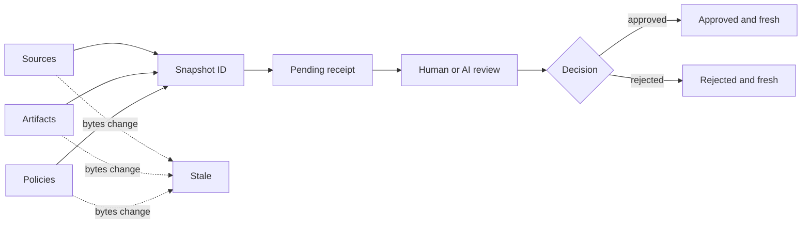

# evidence-lock

Bind a human or AI review decision to the exact source, artifact, and policy bytes it covered, then detect when that approval has gone stale.

[](https://github.com/eun7661010/evidence-lock/actions/workflows/ci.yml)
[](https://github.com/eun7661010/evidence-lock/releases)
[](https://www.python.org/)
[](#compatibility)
[](LICENSE)

[한국어 설명](README.ko.md)

## The problem

A report, generated document, model output, or release candidate is reviewed. Then someone changes the source, the output, or the rules that defined “acceptable.” The approval still says “approved,” but it no longer describes the files in front of you.

`evidence-lock` answers one deliberately narrow question:

> Does this recorded review decision still apply to these exact source, artifact, and policy bytes?

It creates a portable JSON receipt with SHA-256 snapshots, records an explicit human or AI review, and reports `stale` as soon as any captured file changes. It runs locally, makes no network request, requires no Git repository, and has no runtime dependency outside the Python standard library.

## How the receipt changes state



The receipt stores relative POSIX paths, file counts, byte counts, and content hashes. It never stores the absolute root path. Review metadata is bound to the snapshot by a second identifier, so editing the decision, reviewer label, timestamp, or summary makes the receipt `invalid` rather than silently changing its meaning.

## Before and after

An approved receipt is concise enough to inspect and commit:

```json
{
  "receipt_version": "evidence-lock/receipt/v1",
  "snapshot_id": "sha256:…",
  "evidence": {
    "sources": [{"path": "source/draft.txt", "kind": "file", "sha256": "…"}],
    "artifacts": [{"path": "artifact/report.txt", "kind": "file", "sha256": "…"}],
    "policies": [{"path": "policy/review-policy.json", "kind": "file", "sha256": "…"}]
  },
  "review": {
    "reviewer": "reviewer-01",
    "reviewer_type": "human",
    "decision": "approved",
    "review_id": "sha256:…"
  }
}
```

Verification is machine-readable:

```json
{"ok":true,"status":"approved","exit_code":0,"changes":[],"errors":[]}
```

Change `artifact/report.txt` and run the same command again:

```json
{"ok":false,"status":"stale","exit_code":5,"changes":["artifacts:artifact/report.txt: sha256 changed"],"errors":[]}
```

## Three-minute quick start

The repository contains only synthetic example content.

```bash
python -m pip install .
cd examples/synthetic-project

evidence-lock create \
  --source source/draft.txt \
  --artifact artifact/report.txt \
  --policy policy/review-policy.json \
  --output demo-pending.json

evidence-lock review demo-pending.json \
  --reviewer reviewer-01 \
  --reviewer-type human \
  --decision approved \
  --summary "The synthetic report follows the synthetic policy." \
  --output demo-approved.json

evidence-lock verify demo-approved.json --format json
```

The last command exits `0` only while the approved receipt is structurally valid and every captured source, artifact, and policy still matches. The CLI refuses to overwrite an existing receipt.

To try an AI-labelled review, use `--reviewer-type ai`. That field records how the caller classifies the reviewer. `evidence-lock` does not call a model, authenticate a model identity, or decide whether the review was competent.

## Commands

| Command | Purpose |
| --- | --- |
| `evidence-lock create` | Hash one or more sources, artifacts, and policies into a pending receipt |
| `evidence-lock review` | Verify freshness, then create a new immutable reviewed receipt |
| `evidence-lock verify` | Recompute evidence and report `approved`, `pending`, `rejected`, `stale`, or `invalid` |
| `evidence-lock schema` | Print or save the bundled Draft 2020-12 JSON Schema |

All three evidence groups are required. Repeat `--source`, `--artifact`, or `--policy` to capture more than one path. A path may name a file or a directory. Directory hashes cover every regular file's relative name, content hash, and size in deterministic order. An unreadable subtree fails the snapshot instead of being silently omitted.

See [CLI and library reference](docs/cli-and-library.md) for complete arguments and Python examples.

## Verification states and exit codes

| State | Meaning | Exit code |
| --- | --- | ---: |
| `approved` | The receipt and review identifiers are valid, every file matches, and the recorded decision is approved | `0` |
| `pending` | Every file matches, but no review has been recorded | `3` |
| `rejected` | Every file matches, and the recorded decision is rejected | `4` |
| `stale` | The receipt is structurally valid, but a captured path is missing, unreadable, or different | `5` |
| `invalid` | JSON, schema fields, snapshot ID, or review ID is inconsistent | `6` |

CLI input or output errors return `1`; argument parsing errors return `2`. This separation lets CI distinguish “needs review,” “review rejected,” “files changed,” and “receipt was altered.”

## Typical uses

- Invalidate a human approval when a generated PDF, dataset, configuration, or source document changes.
- Bind an AI review result to the exact prompt input, output artifact, and evaluation policy it examined.
- Gate a release job on a fresh local review receipt without depending on a hosted approval database.
- Carry a review decision between Windows, macOS, and Linux without leaking the original absolute path.
- Preserve the policy bytes that were in force, instead of recording only a mutable policy name or version label.

Receipts are plain JSON. They can be committed beside a release candidate, archived with a document package, or passed to a later CI job. Whether that storage location is trusted remains your responsibility.

## Safety and privacy choices

- Evidence paths must be relative to `--root`. Absolute paths and `..` traversal are rejected.
- Evidence paths must be distinct and may not overlap as ancestor and descendant entries across roles.
- Symbolic links are rejected so a snapshot cannot silently cross the declared root.
- Receipt JSON rejects duplicate object keys, lone Unicode surrogates, and timestamps outside the supported RFC 3339 form.
- Receipts store relative paths but never the root, home directory, command line, environment, file contents, or network location.
- Output inside a captured directory is rejected because writing it would make the new receipt stale immediately.
- Existing outputs are never overwritten.
- Reviewer labels and summaries are caller-provided and appear in plaintext. Use non-personal labels and do not put credentials or confidential text in them.

Read the [security and privacy model](docs/security-model.md) before using receipts across a trust boundary.

## What this project does not prove

`evidence-lock` is a freshness and binding guard, not a digital-signature or identity system.

It does **not**:

- authenticate the reviewer or prove that a human or model performed the review;
- prove that an approved artifact is correct, safe, lawful, or high quality;
- protect a receipt and the evidence from an attacker who can rewrite both;
- provide key management, signatures, transparency logs, trusted timestamps, provenance, or a chain of custody;
- execute tests, capture commands, monitor agents, upload evidence, or store file contents;
- track empty directories, timestamps, permissions, or filesystem ownership.

If you need cryptographic identity and signed supply-chain attestations, use tools designed for that problem.

## Relationship to adjacent projects

This project complements rather than replaces established attestation and evidence systems:

- [in-toto](https://in-toto.io/docs/getting-started/) records and verifies signed software supply-chain steps, materials, and products.
- [Witness](https://github.com/in-toto/witness) adds signed attestations, policy evaluation, identity integrations, and provenance workflows.
- [Sigstore Cosign](https://docs.sigstore.dev/cosign/verifying/verify/) verifies signatures and attestations for software artifacts.
- [SLSA provenance](https://slsa.dev/spec/v1.2/provenance) describes where, when, and how software artifacts were produced.
- [DVC](https://dvc.org/doc/user-guide/project-structure/pipelines-files) versions data and reproducible pipeline state.
- [BeforeDone](https://github.com/rrrrrredy/beforedone) binds configured command checks to relevant Git files so coding-agent completion evidence becomes stale after a change.
- [Agent Receipts](https://github.com/inchwormz/agent-receipts) records hash-chained execution evidence and evaluates agent claims.
- [Treeship](https://github.com/zerkerlabs/treeship) provides signed and chained trust receipts, including scoped human approvals for agent actions.

`evidence-lock` stays smaller: it runs outside Git, does not execute a command, has no key or server, and binds three explicitly named file groups to one review decision. See [the design comparison](docs/ecosystem-and-scope.md) for the boundary in more detail.

## Compatibility

CI tests Python 3.10 and 3.13 on the current GitHub-hosted Windows, macOS, and Ubuntu runners. The package supports Python 3.10 through 3.13 and has no runtime dependency.

Portable directory snapshots intentionally ignore timestamps and permission bits. They reject case-insensitive file-name collisions because a directory that works on Linux may otherwise be ambiguous on Windows or common macOS filesystems.

## Documentation

- [Design and receipt semantics](docs/design.md)
- [CLI and Python library reference](docs/cli-and-library.md)
- [Security and privacy model](docs/security-model.md)
- [Ecosystem comparison and scope](docs/ecosystem-and-scope.md)
- [Troubleshooting](docs/troubleshooting.md)
- [Machine-readable capability summary](llms.txt)

## Contributing

Issues and pull requests are welcome. Start with [CONTRIBUTING.md](CONTRIBUTING.md), use synthetic fixtures only, and do not attach private documents, personal paths, credentials, or real review records. The issue tracker marks bounded starter tasks with `good first issue`.

Licensed under the [Apache License 2.0](LICENSE).
